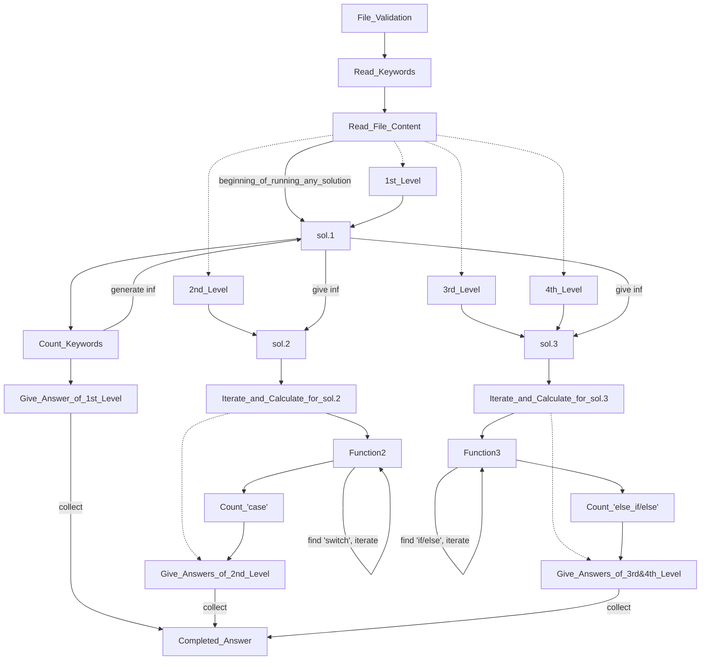
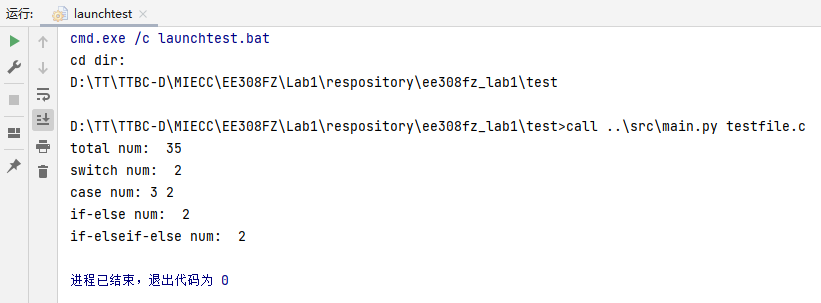
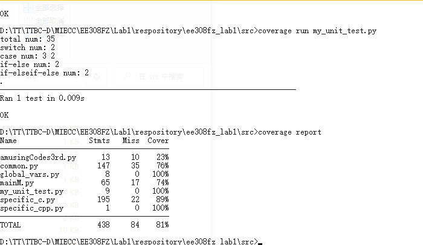
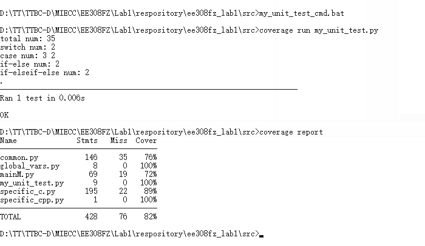
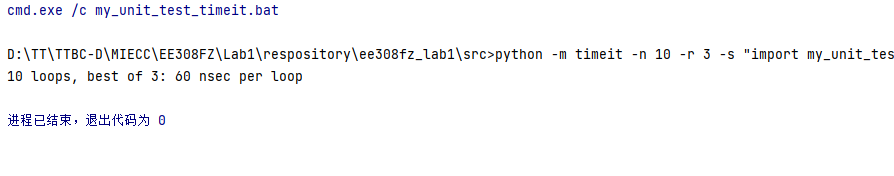

# Development Blog

To see the whole version, go to the End and see HTML version on Github.com.

## Contents

[toc]

## PSP Form

[Top](#Contents)

| Process Stages | Estimated Time(min) | Actual Time(min) |
| --------------------:|:------------------------------:|:-------------------------:|
| Analyze Problem | 10 | 5 |
| Planning Development | 10 | 5 |
| Modelling Project | 30 | 15 |
| Design Basic Framework | 20 | 20 |
| Design & Develop Assistant Tools | 30 | 120 |
| Review Assistant Tools | 10 | 30 |
| Develop Prototype working on 1st Level | 30 | 40 |
| Review & Fortify Program | 10 | 30 |
| Design 2nd Level Program | 30 | 40 |
| Develop & Review 2nd Level Program | 30 | 200 |
| Design 3rd Level Program | 30 | 20 |
| Design 4th Level Program | 40 | 80 |
| Develop & Review 3rd & 4th Level Program | 80 | 200 |
| Refine Details | 20 | 5 |
| Final Test | 20 | 10 |
| Reporting | 40 | 70 |
| Summarizing | 30 | 10 |
| **Total Time** | 470 | 900 |

## Ideas of Problem-solving

[Top](#Contents)

Problem is given in four level and that's good for Incremental model. 

Idea of develop solution:

1. Break problem into parts of tasks and queue them.
2. Think sub solutions for tasks.
3. Code and implement the solutions.
4. Test

## Design and Implement Processes

[Top](#Contents)

Solution steps:

1. Determine file type and check
2. Read corresponding keywords of the language
3. Read the file content
4. Solve for 1st level
5. Solve for 2nd level
6. Solve for 3rd&4th level



## Code Description

[Top](#Contents)

My project used many to assist the development process. But those do nothing with problem-solving, so I will not explain them here.

Here is key codes and their explanation:

### main.py

[Top](#Contents)

This is the entrance of whole program. This file contains $sol.1$ and leads to the rest.

``` python
# Open File Preparation
    f = None
    try:
        # get the file name
        fileName = sys.argv[1]
    except IndexError as ie:
        estr = OINFOHEADER + f'No file input, no first parameter given. {ie}'
        raise IndexError(estr)
    # get the program directory
    programDir = osp.dirname(sys.argv[0])
```

``` python
# Check ext
    fileExt: common.ExtClass = common.ExtClass()
    # determine ext
    fileExt.extSelect(fileName)
```

``` python
# open file
    try:
        f = open(fileName)
    except FileNotFoundError as fe:
        estr = OINFOHEADER + f'{fe}'
        raise FileNotFoundError(estr)
```

``` python
# read keywords
    keys = []
    try:
        with open(osp.join(programDir, f'keywords_{fileExt.ext}.txt')) as fkey:
        # with open(programDir + dirsep + f'keywords_{fileExt.ext}.txt') as fkey:
            t = fkey.read()
            keys = t.split()
    except FileNotFoundError as fe:
        estr = OINFOHEADER + f'{fe}'
        raise FileNotFoundError(estr)
```

``` python
# read file data
    strs = f.readlines()
```

``` python
# work of 1st level
    keycnt, moreinfo = common.countKw(keys, strs)
    print('total num: ', keycnt)
```

``` python
# language-specific part of solution's entrance (of .c file)
	speMDic = {
        'c': specific_c,
        'cpp': specific_cpp
    }
    speMDic[fileExt.ext].entrance(keys, strs, moreinfo)
```

### common.py

[Top](#Contents)

This file contains the common parts of codes, i.e. the public codes for all modules.

``` python
# Class and method for storing and determining ext
class ExtClass():

    ext = None
    exti = 0
    mode: DevMode = sampleModeCommon

    def __init__(self, mode: DevMode=None):
        ...

    def extSelect(self, fileName:str=''):
        # debug code
        ...
        
		# set ext
        t1 = fileName.rsplit(sep='.', maxsplit=3)
        self.ext = t1[-1]

        ...

```

``` python
# This function count keywords in strings from the file.
def countKw(keys, strs:list):
  	...
    
    for i in strs:
        cnt1 = 0
        for j in keys:
            i: str
            a = k = 0
            while True:
                a = i.find(j,a)
                if a == -1:
                    break
                a += keylength[j]
                if i[a].isalpha() is False:
                    # found a keyword here
                    k += 1
                    # pairs of location prepared for more operation
                    p = [idi, a - keylength[j], j]
                    locations.append(p)
            cnt1 += k

        cnt2 += cnt1
        idi += 1
    return cnt2, locations
```

### specific_c.py

[Top](#Contents)

Contains part of solutions for c language.

``` python
# addon entrance
def entrance(pkeys, pstrs, pmoreinfo=None):
    ...
    
    locations = extractWordsBraces(strs, wordLocation)
    
    # process switch-case
    locations_SwCsBraces = extractSwCsBraces(locations)
    SwCnt_Group = countSwCs(locations_SwCsBraces)

    # output SwCs
    print(f'switch num: ', SwCnt_Group.__len__())
    print('case num: ', end='')
    for i in SwCnt_Group:
        print(i, end=' ')
    print('')
    
    # process if-else, if-elseif-else
    # these codes are only designed for cases with entire braces attached to keywords.
    locations_IfEsBraces = extractIfEsBraces(locations)
    cnt_IfEs, cnt_IfEsifEs = countIfEs(locations_IfEsBraces)
    cntIFES = [cnt_IfEs, cnt_IfEsifEs]

    # output IFES
    print(f'if-else num: ', cnt_IfEs)
    print(f'if-elseif-else num: ', cnt_IfEsifEs)

```

``` python
# This function count 'switch's and each group's 'case's. Support nested structure.
def countSwCs(plocations_SwCsBraces):
    ...

    i = 0
    while i < length:
        # find a 'switch', do iteration
        if plocations_SwCsBraces[i][2]=='switch':
            ...
            interval = [i, endBrace+1]
            intervals.append(interval)
            # iterate
            CsCntItr = countSwCs(plocations_SwCsBraces[i+1:endBrace+1])
            SwCnt_Group.extend(CsCntItr)
            # print(SwCnt_Group)
            i = endBrace
        i += 1

    ...
    
	# count 'case's of given strings
    i = 0
    while i < length:
        ...
        
        if plocations_SwCsBraces[i][2]=='case':
            CsCnt += 1
        i += 1
    if CsCnt!=0:
        SwCnt_Group.append(CsCnt)
    return SwCnt_Group

```

``` python
# This function figures the answers of sol.3. Support nested structure.
def countIfEs(plocations_IfEsBraces):
    ...
    while i < length:
        # find a/an 'if'/'else', do iteration
        if plocations_IfEsBraces[i][2] == 'if' or \
                (plocations_IfEsBraces[i][2] == 'else' and plocations_IfEsBraces[i+1 if i+1 <length else i][2] != 'if'):
            ...
            interval = [i + 2, endBrace]
            intervals.append(interval)
            # iterate
            retv = countIfEs(plocations_IfEsBraces[i + 1:endBrace + 1])
            ...
            cnt_IfEs += retv[0]
            cnt_IfEsifEs += retv[1]
            i = endBrace
        i += 1

    ...
    
    # count cases of 'if-else' and 'if-elseif-else' of given strings
    i = 0
    tlength = tpifesloclist.__len__()
    while i < tlength:
        if tpifesloclist[i][2] == 'else':
            if tpifesloclist[i+1 if i+1<tlength else i][2] == 'if':
                cnt_IfEsifEs += 1
                while i < tlength:
                    if tpifesloclist[i][2] == 'else' and tpifesloclist[i+1 if i+1<tlength else i][2] != 'if':
                        break
                    i += 1
            elif tpifesloclist[i+1 if i+1<tlength else i][2] == '{':
                cnt_IfEs += 1
        i += 1
    cntIFES = [cnt_IfEs, cnt_IfEsifEs]
    return cntIFES
```

## Unit Test

[Top](#Contents)

my_unit_test.py

### Screenshots and Description

[Top](#Contents)

#### Test Data

[Top](#Contents)

Test file, $testfile.c$, is copied from website. See the website at the [End](#End).

#### Result

[Top](#Contents)

Picture shown below tells that of 4th level, i.e. the ultimate requirement. It goes to expectation.





### Coverage Optimization

[Top](#Contents)

Comment useless codes.



$81$% -> $82$%

### Performance Testing

[Top](#Contents)



## Summary

[Top](#Contents)

In this program, I used lots of new knowledge. Software Engineering is truly a systematic engineering. Methodology is really important.

## End

[Top](#Contents)

| The Link Your Class                        | https://bbs.csdn.net/forums/MUEE308FZU202201 |
| ------------------------------------------ | -------------------------------------------- |
| The Link of Requirement of This Assignment | https://bbs.csdn.net/topics/608734907        |
| The Aim of This Assignment                 | Note the development processes.              |
| MU STU ID and FZU STU ID                   | 20123850_832001217                           |

Project on Github.com: https://github.com/LiuJiewenTT/ee308fz_lab1

URL on github.com of this passage(download): https://liujiewentt.github.io/ee308fz_lab1/development%20blog.md<br/>
URL on github.com of this passage(view with Github md): https://github.com/LiuJiewenTT/ee308fz_lab1/tree/main/development%20blog.md

URL on github.com of this passage(view as html): https://liujiewentt.github.io/ee308fz_lab1/development%20blog.html<br/>
URL on csdn.net of this passage(view as html): https://bbs.csdn.net/topics/608838406